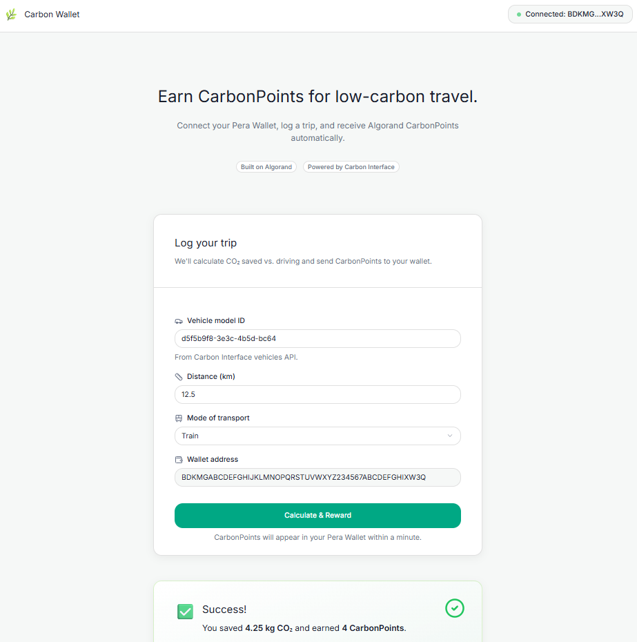

# 🌿 Carbon Wallet — Earn CarbonPoints for Low-Carbon Travel

**Carbon Wallet** is a decentralized app built on **Algorand** that rewards users for choosing sustainable modes of transport.
When users log their trips, the system calculates how much CO₂ they saved versus driving — and instantly issues **CarbonPoints (CPT)** to their **Pera Wallet** as on-chain tokens.

---

## 🚀 Problem
Today, sustainability is hard to measure and harder to reward.
People bike, take trains, or use public transport — but rarely get tangible credit for their reduced carbon footprint.
We wanted to make **climate-friendly actions measurable, visible, and rewarding**.

---

## 🌍 Our Solution
**Carbon Wallet** uses verified emission data (via the [Carbon Interface API](https://www.carboninterface.com)) and the **Algorand blockchain** to:
1. Calculate CO₂ savings when a user chooses a low-carbon travel mode.
2. Convert saved CO₂ into **CarbonPoints (CPT)** at Fairtrade carbon credit rates.
3. Issue these tokens directly to the user’s wallet on Algorand.

---

## 🧩 How It Works

### 1️⃣ User Flow
1. User connects their **Pera Wallet** on the front-end (React app).
2. They log a trip — specifying:
   - Vehicle model ID (from Carbon Interface API)
   - Distance (km)
   - Mode of transport (train, bus, bike, etc.)
3. The backend (FastAPI + Python) calls the **Carbon Interface API** to compute baseline car emissions and saved CO₂.
4. Based on the CO₂ saved, the system mints **CarbonPoints** and sends them via the Algorand SDK to the user’s wallet.
5. The frontend displays the points earned and a transaction link on **AlgoExplorer** for verification.

### 2️⃣ Smart Contract Logic (Algopy)
- Written in Algorand Python (Algopy).
- Defines a simple **ARC4 contract** (`CarbonWallet`) with a method `issue_points(user, points)` that records issuance events.
- The smart contract ensures transparency by registering every “reward” action on-chain.

### 3️⃣ Backend (FastAPI + Algorand SDK)
Handles:
- CO₂ computation
- Token creation (ASA setup)
- Token transfer to user wallet
- REST API endpoint `/calculate_and_reward`

### 4️⃣ Frontend (React)
- Connects with **Pera Wallet** using `@perawallet/connect`
- Form fields: Vehicle model ID, Distance (km), Mode of transport, Wallet address
- Displays result card with:
  - ✅ Carbon saved (kg CO₂)
  - 🏅 CarbonPoints earned
  - 🔗 Transaction link to AlgoExplorer

---

## 🧱 Tech Stack

| Layer | Tools / Frameworks |
|--------|--------------------|
| Blockchain | **Algorand**** |
| Backend | **FastAPI**, **Python 3.14**, **Algorand SDK**, **Carbon Interface API** |
| Frontend | **React**, **Vite**, **Pera Wallet SDK** |
| Design | **Figma** (UI + Flow Mockups) |
| Hosting | **Local / TestNet** for demo |

---

## 🧮 Carbon Calculation Logic

Implemented in `backend/carbon_engine.py`
```python
carbon_points = round(carbon_saved_kg * 0.91)
```
The calculation uses DEFRA 2024 emission factors and Fairtrade carbon credit pricing (€9.10/tCO₂e).
Every 1 kg CO₂ saved ≈ **0.91 CarbonPoints**.

---

## 🗂️ Repository Structure

```
Carbon_Wallet/
├── carbon-aquarian-contracts/
│   ├── carbon_engine.py        # Carbon savings calculator
│   ├── algorand_utils.py       # Token creation + transfer (Algorand SDK)
│   ├── main.py                 # FastAPI app (endpoint: /calculate_and_reward)
│   └── .env                    # Private keys, wallet address, asset ID
│
├── smart_contracts/
│   └── carbon_wallet/
│       └── contract.py         # Algopy smart contract (ARC4)
│
├── carbon-aquarian-frontend/
│   ├── src/
│   │   ├── components/
│   │   │   ├── EmptyState.tsx
│   │   │   ├── Footer.tsx
│   │   │   ├── Header.tsx
|   |   |   ├── Hero.tsx
|   |   |   ├── ResultCard.tsx
│   │   |   └── TripForm.tsx
│   │   ├── contracts/
│   │   |   └── Backend.ts
│   │   ├── api.js
│   │   ├── App.tsx
│   │   └── main.tsx
│   └── package.json
│
├── README.md
├── algokit.toml
└── pyproject.toml
```

---
## 💻 Setup Instructions

### 1️⃣ Clone the repo and start Docker
```bash
git clone https://github.com/tbetti/carbon-wallet.git
cd carbon-wallet
```

### 2️⃣ Run in the project directoryto set up your environment by installing necessary dependencies, setting up a Python virtual environment, and preparing your `.env` file.
```bash
algokit project bootstrap all
```

### 3️⃣ Backend/Smart contract setup
```bash
cd carbon-aquarian-contracts
algokit sandbox start
algokit localnet start
```

### 4️⃣ Frontend setup
```bash
cd carbon-aquarian-frontend
algokit project bootstrap all
algokit project run build
npm install
npm run build
npm run dev
```

Access app at **http://localhost:3000**

---

## 🎥 Demo Video
🎬 **[Watch our walkthrough →](./projects/carbon-aquarian-frontend/public/demo.mp4)**
> In this demo, we show:
> - Connecting Pera Wallet
> - Logging a trip
> - Carbon savings calculation
> - Blockchain token issuance (CarbonPoints)
> - Transaction verification on AlgoExplorer

---

## 🖼️ UI Preview



> The user logs a trip, clicks “Calculate & Reward,” and instantly sees their CarbonPoints earned — verified on Algorand TestNet.

---

## 🔐 Smart Contract Overview
- Contract Name: `CarbonWallet`
- Type: `ARC4Contract`
- Deployed to: Algorand TestNet
- Function: `issue_points(user, points)`
- Output: emits confirmation string + logs transaction hash
- Security: all transactions signed by admin key; users cannot self-mint tokens.

---

## 🌱 Future Scope
- CarbonPoints redemption (marketplace integration)
- Exhange between companies and net positive carbon footprint entities like farmers
- NFT-based carbon certificates for large CO₂ offsets
- On-chain transparency dashboard for sustainability data

---

## 🧑‍💻 Team
- **Mahnoor Bilal** — Data Scientist
- **Tiana Bettinson** - Front-End Software Engineer
- **Aldo Febrien** - Back-End Software Engineer

---

## 🏆 Hackathon Submission Notes
